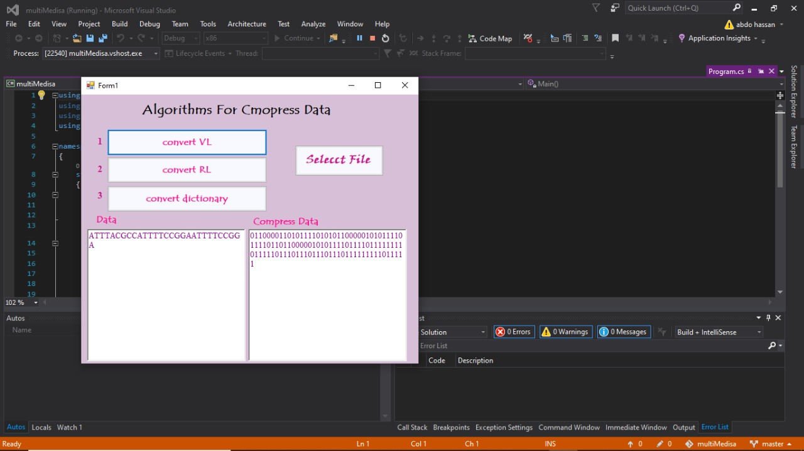

# Multi-Media Project 💻😀

Simple GUI application made with C# as a college assignment.

### Description 📄

This application covers 3 different algorithms includes run length encoding, variable length encoding and dictionary based coding algorithm 💥 .

### Requirements 🔢

1. Visual Studio
2. C# should be installed on your system

### installation 🪓

1. create an empty folder with your favourite name
2. open your visual studio in the root of this folder
3. open your terminal and type `git clone https://github.com/Abdo-hassa/Multimedia-project-.git` **Notice this step requires git installed on your pc**
4. Or simply press the green code button above and download ZIP file then extract it 👍

that's it 😁

### How the app looks like 🤔

Whenever you run the app you should see this window as a default behaviour.

You should select a text file from the right button to perform the algorithm on as the following picture.

And then you could choose whatever you want among the three algorithms .. here I chosed the variable length for example.

Run length ⤵️

Dictionary based coding ⤵️

by **Abdallah Hassan & Mena Aziz Kamel**
